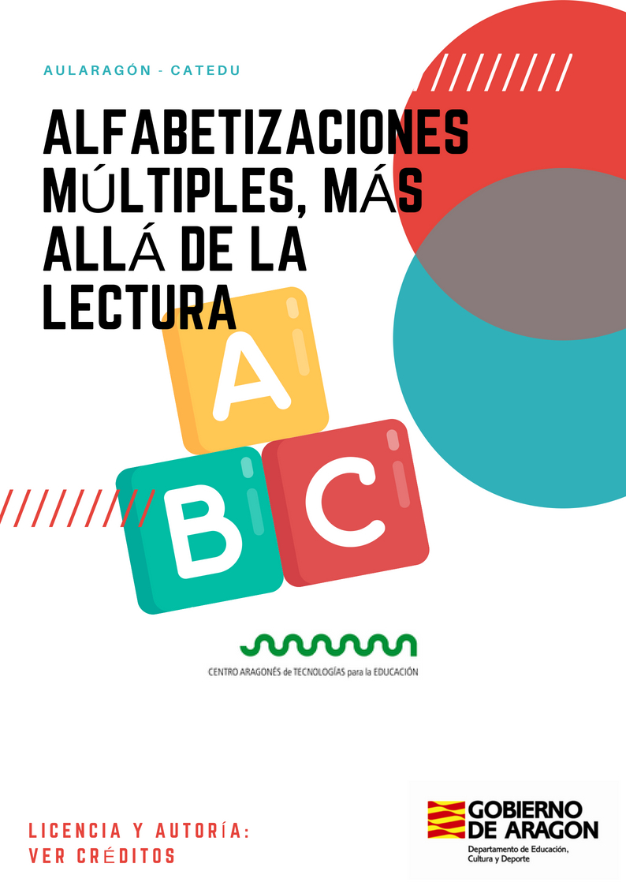
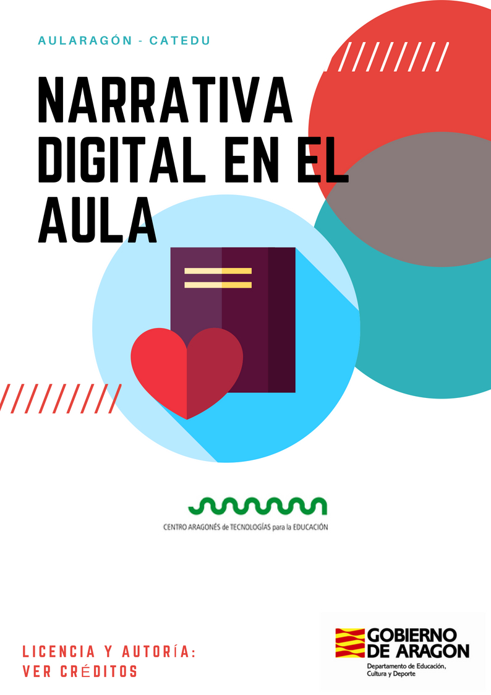
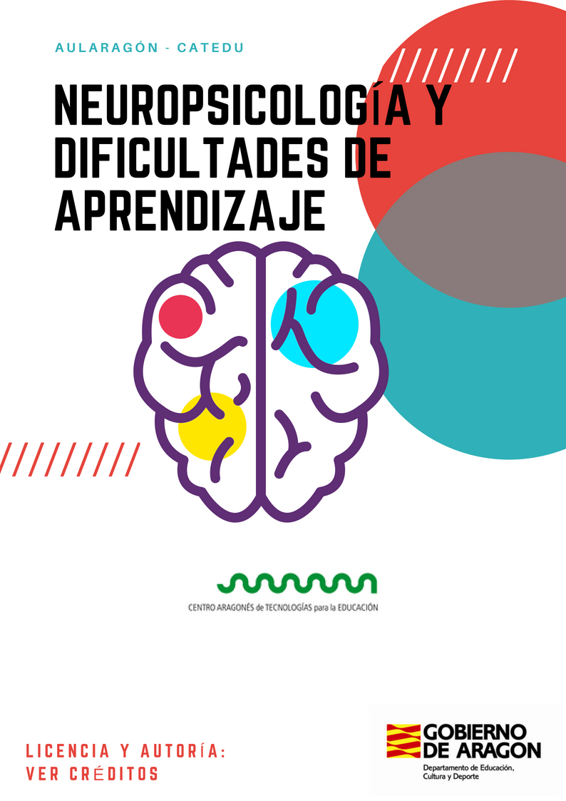

# CATEDU
### Gestión del conocimiento colectivo

### ¿Por dónde íbamos?
* Contenidos difíciles de mantener.
* Contenidos que no se podían descargar en un formato amigable
* Información repetida y en algunos casos desactualiada

